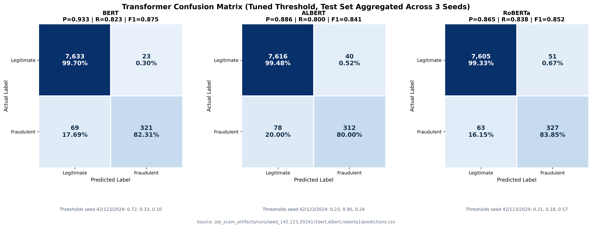

# Job Scam Detection with BERT, ALBERT, and RoBERTa

[EN](README.md) | [ID](README.id.md)

A machine learning project for detecting fraudulent job postings with Transformer-based text classification. The research scope in this repository focuses on comparing three pretrained Transformer models: BERT, ALBERT, and RoBERTa. The repository also includes a Streamlit web app for real-time inference using the exported Transformer model.

## Results

The latest executed notebook is `research_pipeline.ipynb`, including the completed Colab run outputs. This README summarizes only the Transformer experiments because the thesis discussion focuses on BERT, ALBERT, and RoBERTa.

Dataset: [EMSCAD](https://www.kaggle.com/datasets/shivamb/real-or-fake-fake-jobposting-prediction), with 17,880 job postings and 866 fraudulent postings (4.84% fraud rate).

### Alignment with Chapter IV

This README is aligned with Chapter IV, Results and Discussion, of the thesis. The documented flow follows the same order used in the chapter: EMSCAD dataset description, stratified splitting, imbalance handling, Transformer tokenization, model fine-tuning, tuned-threshold evaluation, confusion matrix interpretation, and deployment of the selected model.

For that reason, the reported experiment summary focuses only on BERT, ALBERT, and RoBERTa. The metrics are also kept consistent with Chapter IV: accuracy is reported for general correctness, precision and recall explain the trade-off on the fraud class, Fraud F1 summarizes that balance, while ROC-AUC and PR-AUC are used to evaluate ranking quality on an imbalanced dataset. The confusion matrix section mirrors the discussion in Chapter IV by showing how each Transformer model distributes true positives, true negatives, false positives, and false negatives.

### Data Split

Each experiment uses a stratified 70/15/15 split on the `fraudulent` label. The final run used three seeds: `42`, `123`, and `2024`.

| Split | Samples | Fraud Samples | Percentage |
|-------|---------|---------------|------------|
| Train | 12,516 | 606 | 70% |
| Validation | 2,682 | 130 | 15% |
| Test | 2,682 | 130 | 15% |

### Experiment Setup

- **Run mode:** `full_multi_seed`
- **Models:** BERT, ALBERT, RoBERTa
- **Seeds:** `42`, `123`, `2024`
- **Max sequence length:** 256 tokens
- **Batch size:** 16
- **Epochs:** 5
- **Optimizer:** AdamW, learning rate `2e-5`, weight decay `0.01`, warmup ratio `0.1`
- **Imbalance handling:** weighted cross-entropy during Transformer fine-tuning
- **Thresholding:** thresholds tuned on the validation set, then evaluated on the test set
- **Hardware:** Google Colab Tesla T4 GPU

### Mean Test Metrics Across 3 Seeds

Metrics below are mean +/- standard deviation using tuned thresholds. The positive class is `fraudulent`.

| Model | Accuracy | Precision | Recall | Fraud F1 | ROC-AUC | PR-AUC | Runtime |
|-------|----------|-----------|--------|----------|---------|--------|---------|
| BERT | **0.9886 +/- 0.0024** | **0.9331 +/- 0.0225** | 0.8231 +/- 0.0353 | **0.8745 +/- 0.0273** | **0.9895 +/- 0.0030** | **0.9232 +/- 0.0214** | 28.24 +/- 0.93 min |
| RoBERTa | 0.9858 +/- 0.0036 | 0.8652 +/- 0.0394 | **0.8385 +/- 0.0407** | 0.8515 +/- 0.0380 | 0.9872 +/- 0.0070 | 0.9106 +/- 0.0247 | **26.13 +/- 3.65 min** |
| ALBERT | 0.9853 +/- 0.0035 | 0.8875 +/- 0.0292 | 0.8000 +/- 0.0846 | 0.8395 +/- 0.0455 | 0.9849 +/- 0.0131 | 0.9007 +/- 0.0239 | 32.63 +/- 0.14 min |

**Best Transformer model:** BERT, based on the strongest Fraud F1, precision, ROC-AUC, and PR-AUC across the three-seed evaluation.

RoBERTa has the highest fraud recall, so it catches slightly more fraudulent postings. BERT is selected for deployment because it gives the best balance between catching fraud and keeping false alarms low.

### Confusion Matrix Overview

The confusion matrix visualization below aggregates the tuned-threshold test predictions from all three seeds, for a total of 8,046 test samples.



| Model | TN | FP | FN | TP | Main Interpretation |
|-------|----|----|----|----|---------------------|
| BERT | 7,633 | 23 | 69 | 321 | Lowest false positives and strongest precision |
| ALBERT | 7,616 | 40 | 78 | 312 | Most missed fraud cases among the three models |
| RoBERTa | 7,605 | 51 | 63 | 327 | Best fraud recall, but with more false positives |

### Exported Deployment Model

The exported deployment model from the executed notebook is BERT seed `2024`, with selected threshold `0.10`.

| Exported Model | Accuracy | Precision | Recall | Fraud F1 | PR-AUC | ROC-AUC |
|----------------|----------|-----------|--------|----------|--------|---------|
| BERT seed 2024 | 0.9899 | 0.9328 | 0.8538 | 0.8916 | 0.9239 | 0.9902 |

### Current Review Notes

These notes are retained for reproducibility and should be checked before treating the notebook run as a locked final experiment.

- **Early stopping was configured but not active in the Colab run.** The output contains repeated warnings that `eval_validation_fraud_f1` was not found, so Transformer runs should be treated as 5-epoch runs until this is fixed and rerun.
- **Transformer checkpoint reload warnings appeared.** The run used `transformers 5.0.0` and emitted missing/unexpected LayerNorm key warnings when loading checkpoints. This should be investigated before using the checkpoint results as final paper evidence.

## Project Structure

```text
app.py                       # Streamlit entry point
src/                         # MVC application code
  controllers/
    app_controller.py         # Orchestrates input -> preprocess -> predict -> render
  models/
    classifier.py             # Loads ./best_model and runs inference
    ocr_engine.py             # Tesseract OCR wrapper
    preprocessor.py           # Text cleaning aligned with the notebook
  views/
    main_view.py              # Streamlit UI rendering
artifacts/figures/            # Research figures, including confusion matrix visualization
research_pipeline.ipynb       # Executed Transformer training and evaluation notebook
requirements.txt              # Python dependencies
test_data.txt                 # Manual test samples
best_model/                   # Exported Transformer artifact, git-ignored
docs/                         # Design notes and planning docs
```

## Architecture

The app follows a Model-View-Controller split so the Streamlit UI, business logic, and ML concerns stay separate.

- **View** (`src/views/main_view.py`): Streamlit rendering for the header, input form, and result display.
- **Model** (`src/models/`): inference and preprocessing logic. `classifier.py` loads the exported model from `./best_model`, `preprocessor.py` mirrors notebook text cleaning, and `ocr_engine.py` wraps Tesseract for image uploads.
- **Controller** (`src/controllers/app_controller.py`): wires the view, preprocessor, classifier, and OCR flow.

`app.py` is a thin entry point that instantiates `AppController`, so `streamlit run app.py` starts the application.

## Setup

### 1. Install dependencies

```bash
python -m venv venv
source venv/bin/activate        # Linux/Mac
venv\Scripts\activate           # Windows
pip install -r requirements.txt
```

### 2. Install Tesseract OCR

The image upload feature requires Tesseract OCR to extract text from screenshots.

- **Windows:** install from [UB-Mannheim/tesseract](https://github.com/UB-Mannheim/tesseract/wiki). The default path (`C:\Program Files\Tesseract-OCR`) is auto-detected by the app.
- **Linux:** `sudo apt install tesseract-ocr`
- **Mac:** `brew install tesseract`

If you only use text input, Tesseract is not required.

### 3. Get or train model weights

The app loads `./best_model/` on startup and fails early if it is missing.

**Option A: Use the latest exported Transformer artifact**

[Download `best_model`](https://drive.google.com/file/d/1r6ikkGpA2ONTEs3A9TzMWvHDIcNazPYF/view?usp=drive_link) and extract it at the project root so `./best_model/` contains the model weights, tokenizer, and `model_meta.json`. In the latest executed run, the exported model is BERT seed `2024`.

**Option B: Train from scratch**

Open `research_pipeline.ipynb` in Jupyter or Google Colab. Download the EMSCAD dataset as `fake_job_postings.csv` and place it in the project root or upload it in Colab. Run all cells to regenerate the Transformer experiment outputs and export `best_model/`.

The latest full run completed on Google Colab Free with a Tesla T4 GPU.

### 4. Run the web app

```bash
streamlit run app.py
```

Open http://localhost:8501 in your browser. To sanity-check the setup, copy either sample from `test_data.txt` into the text input and click **Analyze**.

## Features

- **Text input:** paste a job description directly
- **Image upload:** upload a screenshot; text is extracted via OCR
- **Confidence score:** shows prediction confidence
- **Class imbalance handling:** weighted loss during Transformer fine-tuning
- **Research comparison:** BERT, ALBERT, and RoBERTa across three seeds

## Limitations and Responsible Use

Treat the model output as a screening signal, not a verdict. Pair it with external checks such as company registration, recruiter identity, domain age, unrealistic salary claims, and payment requests.

- **False negatives remain possible.** The exported BERT run has recall `0.8538`, so some fraudulent postings are still missed.
- **False positives remain possible.** The exported BERT run has precision `0.9328`; a scam flag should trigger review, not automatic rejection.
- **English only.** EMSCAD is an English-language dataset. Other languages are out of distribution.
- **Dataset drift.** EMSCAD is older than current scam patterns, so newer tactics may not be captured.
- **256-token truncation.** Signals appearing late in long descriptions may be cut off.
- **OCR reliability.** Image uploads depend on Tesseract quality.
- **Not legal or financial advice.** Do not use this tool as the sole basis for accepting, rejecting, or reporting a job offer.

## Tech Stack

- **Models:** BERT, ALBERT, RoBERTa
- **Training:** PyTorch, Hugging Face Transformers, Hugging Face Trainer
- **Data and metrics:** pandas, NumPy, scikit-learn
- **App:** Streamlit
- **OCR:** pytesseract with Tesseract
- **Metrics:** accuracy, precision, recall, F1, ROC-AUC, PR-AUC, confusion matrix, runtime, inference latency
