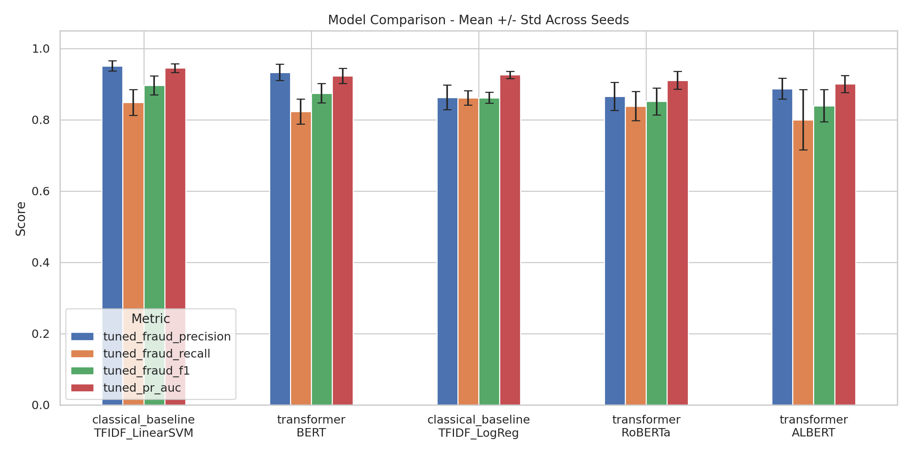
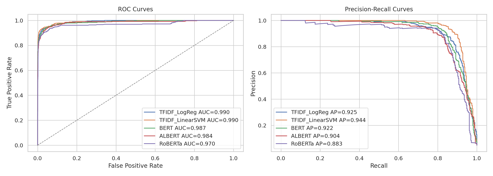
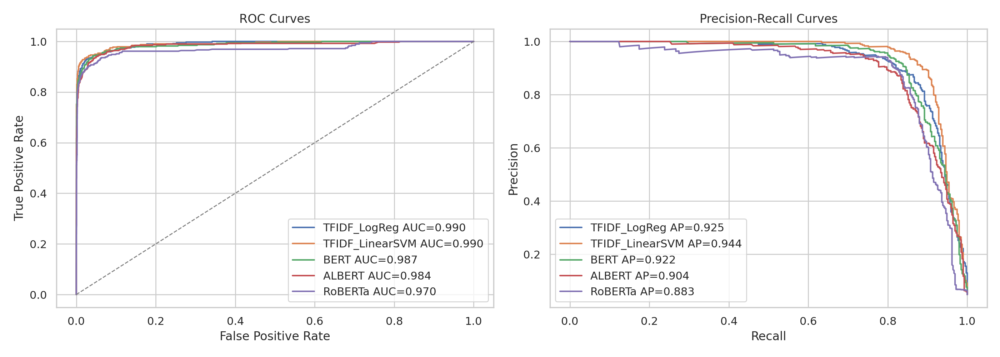
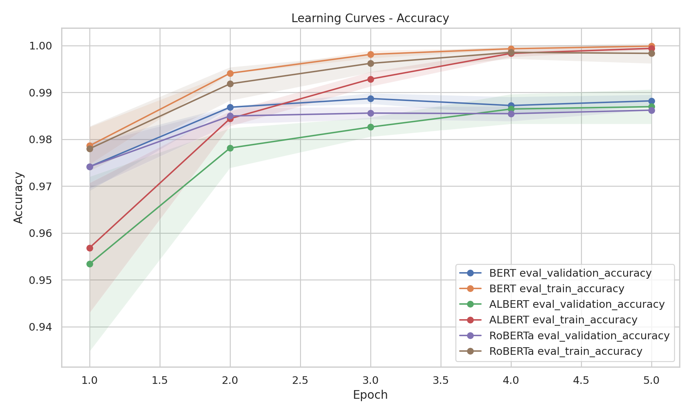
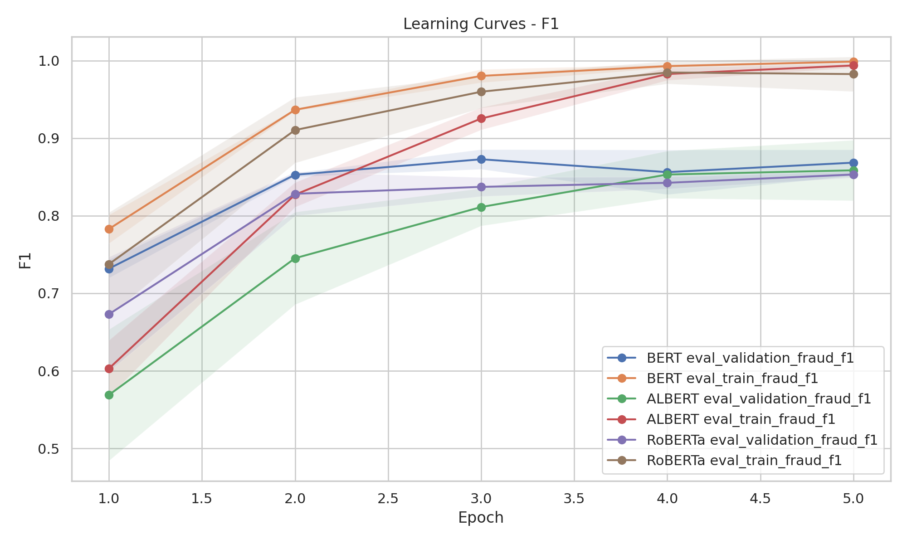
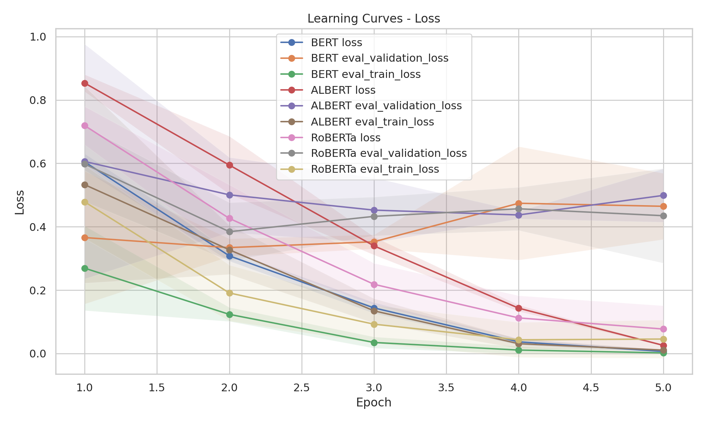

# Catatan Penelitian / Dokumen Penyusunan Naskah
**Skripsi:** *Rancang Bangun Aplikasi Job Scam Detection*
**Notebook sumber:** `research_pipeline.ipynb`
**Tanggal kompilasi:** 2026-05-01
**Lingkungan eksekusi:** Google Colab, GPU Tesla T4, PyTorch 2.10.0+cu128, Transformers 5.0.0, Python 3.12.13, FP16 aktif

---

## 1. Ringkasan Eksperimen

### 1.1 Dataset
Eksperimen menggunakan **EMSCAD (Employment Scam Aegean Dataset) — `fake_job_postings.csv`** yang dimuat dari snapshot Google Drive. Statistik tingkat tinggi:

| Metrik | Nilai |
|---|---|
| Total sampel | 17.880 |
| Lowongan asli (label = 0) | 17.014 |
| Lowongan penipuan (label = 1) | 866 |
| Tingkat fraud | 4,84% |

Dataset ini sangat tidak seimbang (highly imbalanced). Lima kolom teks bebas digabungkan menjadi input model: `title`, `company_profile`, `description`, `requirements`, `benefits`. Tiga di antaranya memiliki proporsi missing yang besar (`company_profile`: 3.308 missing; `requirements`: 2.696; `benefits`: 7.212), yang diisi dengan string kosong sebelum digabungkan. Metadata kategorikal (`telecommuting`, `has_company_logo`, `has_questions`, `employment_type`, `required_experience`, `industry`, `function`) disimpan untuk analisis subkelompok namun **tidak** dimasukkan ke model.

### 1.2 Praproses Teks
Fungsi `clean_text` deterministik diterapkan pada teks gabungan. Pipeline sengaja dibuat minimal agar mayoritas normalisasi dilakukan oleh tokenizer model:

1. Unescape entitas HTML (`html.unescape`).
2. Menghapus tag HTML (`<[^>]+>`).
3. Menghapus URL yang cocok dengan pola `http\S+|www\.\S+`.
4. Lowercasing.
5. Memadatkan whitespace.

Pembersihan teks ini sengaja dibuat identik antara notebook dan modul `src/models/preprocessor.py` agar pipeline pelatihan dan inferensi tetap konsisten ketika model dideploy ke aplikasi.

### 1.3 Metodologi
Pipeline mengikuti protokol **repeated stratified holdout** yang dirancang untuk kelas minoritas yang kecil:

- Tiga seed independen (`42`, `123`, `2024`); setiap seed menghasilkan splitnya sendiri-sendiri.
- Rasio split stratified: 70% train (12.516) / 15% validation (2.682) / 15% test (2.682), dengan tingkat fraud 4,84% dipertahankan di setiap split (130 kasus fraud per test set).
- Lima model dilatih per seed (total 15 run): dua baseline klasik dan tiga Transformer.
- **Penanganan imbalance:** `WeightedTrainer` kustom yang menyuntikkan inverse-frequency class weights ke `nn.CrossEntropyLoss` (`weight = total / (2 · class_count)`).
- **Threshold tuning:** untuk setiap pasangan model+seed, threshold operasi di-grid-search pada *validation set* dengan rentang `[0.10, 0.90]` step 0.01 untuk memaksimalkan F1 kelas fraud. Threshold yang terpilih dibekukan dan diaplikasikan pada test set.
- **Uji signifikansi statistik:** setiap pasangan model dibandingkan dengan paired bootstrap test (1.000 iterasi, seed 777) pada test set, melaporkan selisih rata-rata, CI 95%, dan p-value perkiraan untuk fraud-F1 dan PR-AUC.
- **Logging operasional:** runtime wall-clock, latensi inferensi (batch 128 sampel × 3 pengulangan), dan ukuran model di disk dicatat per run.

#### Daftar model yang dibandingkan

| Kelompok | Label | Backbone |
|---|---|---|
| Baseline klasik | TFIDF_LogReg | TF-IDF (1-2 gram, 50k fitur, sublinear_tf) → Logistic Regression |
| Baseline klasik | TFIDF_LinearSVM | TF-IDF (sama) → Linear SVM |
| Transformer | BERT | `bert-base-uncased` |
| Transformer | ALBERT | `albert-base-v2` |
| Transformer | RoBERTa | `roberta-base` |

---

## 2. Perbandingan Performa Model

Seluruh angka di bawah ini adalah agregat tiga seed (mean ± std) pada **test set yang divalidasi dengan threshold hasil tuning**. Sumber: `artifacts/summary/mean_std_by_model.csv`. Awalan "fraud" menandakan metrik dihitung untuk kelas minoritas/positif (kelas yang relevan secara operasional).

### 2.1 Perbandingan utama — BERT, ALBERT, RoBERTa

| Model | Accuracy | Precision (fraud) | Recall (fraud) | F1 (fraud) |
|---|---|---|---|---|
| **BERT** (`bert-base-uncased`) | **0,9886 ± 0,0024** | **0,9331 ± 0,0225** | 0,8231 ± 0,0353 | **0,8745 ± 0,0273** |
| RoBERTa (`roberta-base`) | 0,9858 ± 0,0036 | 0,8652 ± 0,0394 | **0,8385 ± 0,0407** | 0,8515 ± 0,0380 |
| ALBERT (`albert-base-v2`) | 0,9853 ± 0,0035 | 0,8875 ± 0,0292 | 0,8000 ± 0,0846 | 0,8395 ± 0,0455 |

Cetak tebal menandai nilai terbaik per kolom. Di antara Transformer: BERT unggul pada Accuracy, Precision, dan F1; RoBERTa unggul tipis pada Recall.

### 2.2 Perbandingan lengkap termasuk baseline dan metrik AUC

| Model | Accuracy | Precision | Recall | F1 | Macro-F1 | Balanced Acc. | Specificity | ROC-AUC | PR-AUC |
|---|---|---|---|---|---|---|---|---|---|
| TFIDF_LinearSVM | 0,9906 ± 0,0023 | 0,9509 ± 0,0144 | 0,8487 ± 0,0364 | 0,8968 ± 0,0264 | 0,9459 | 0,9232 | 0,9978 | 0,9904 | 0,9449 |
| BERT | 0,9886 ± 0,0024 | 0,9331 ± 0,0225 | 0,8231 ± 0,0353 | 0,8745 ± 0,0273 | 0,9342 | 0,9100 | 0,9970 | 0,9895 | 0,9232 |
| TFIDF_LogReg | 0,9866 ± 0,0017 | 0,8627 ± 0,0346 | 0,8615 ± 0,0204 | 0,8617 ± 0,0157 | 0,9273 | 0,9272 | 0,9929 | 0,9903 | 0,9261 |
| RoBERTa | 0,9858 ± 0,0036 | 0,8652 ± 0,0394 | 0,8385 ± 0,0407 | 0,8515 ± 0,0380 | 0,9220 | 0,9159 | 0,9933 | 0,9872 | 0,9106 |
| ALBERT | 0,9853 ± 0,0035 | 0,8875 ± 0,0292 | 0,8000 ± 0,0846 | 0,8395 ± 0,0455 | 0,9159 | 0,8974 | 0,9948 | 0,9849 | 0,9007 |

#### Figur perbandingan model

#### Figur ROC dan precision-recall

### 2.3 Fraud-F1 per seed pada test set (data mentah yang menyusun rata-rata di atas)

| Seed | TFIDF_LogReg | TFIDF_LinearSVM | BERT | ALBERT | RoBERTa |
|---|---|---|---|---|---|
| 42 | 0,8775 | 0,9194 | 0,8889 | 0,8560 | 0,8692 |
| 123 | 0,8462 | 0,8678 | 0,8430 | 0,7881 | 0,8078 |
| 2024 | 0,8614 | 0,9032 | 0,8916 | 0,8745 | 0,8775 |

Seed 123 secara konsisten merupakan seed terlemah untuk semua model. Seed 2024 menghasilkan run BERT terkuat (F1 = 0,8916) yang diekspor ke aplikasi. Tidak ada satu seed yang terbaik untuk seluruh model, namun **seed 2024 memenangkan empat dari lima model** pada metrik F1, sehingga merupakan kandidat yang masuk akal sebagai seed "perwakilan" pada figur yang tidak bisa menampilkan ketiganya sekaligus.

### 2.4 Threshold default (= 0,5) versus threshold hasil tuning

Tahap threshold tuning memberi efek nyata dan layak didokumentasikan. Selisih rata-rata fraud-F1 pada test set:

| Model | F1 threshold default (mean) | F1 threshold tuning (mean) | Δ (poin persen) |
|---|---|---|---|
| TFIDF_LogReg | 0,8534 | 0,8617 | +0,83 |
| TFIDF_LinearSVM | 0,8976 | 0,8968 | −0,08 |
| BERT | 0,8714 | 0,8745 | +0,31 |
| ALBERT | 0,8439 | 0,8395 | −0,44 |
| RoBERTa | 0,8546 | 0,8515 | −0,30 |

Secara absolut selisihnya kecil (masih dalam rentang noise untuk sebagian besar model), dan **TFIDF_LinearSVM, ALBERT, serta RoBERTa justru kehilangan sebagian kecil poin persen** karena threshold yang dipilih dari validation tidak sempurna ditransfer ke test set. Walaupun demikian, protokol tuning tetap bermanfaat: ia menyingkap anomali kalibrasi pada ALBERT seed 123 (threshold pemenang 0,90) dan memberikan BERT seed 2024 titik operasi terbaiknya (0,10), yang berdampak pada peningkatan recall dibandingkan threshold 0,50.

### 2.5 Run terbaik tunggal yang diekspor untuk aplikasi
`select_best_completed_run` mengurutkan run Transformer berdasarkan `tuned_fraud_f1`. Pemenang (`best_model/model_meta.json`):

- **Model:** BERT (`bert-base-uncased`)
- **Seed:** 2024
- **Threshold terpilih:** 0,10
- **Metrik test:** Accuracy 0,9899 · Precision 0,9328 · Recall 0,8538 · F1 **0,8916** · Macro-F1 0,9431 · Balanced Acc. 0,9254 · Specificity 0,9969 · ROC-AUC 0,9902 · PR-AUC 0,9239

### 2.6 Total confusion matrix test set (penjumlahan tiga seed, n = 8.046; positif = 390)

| Kelompok | Model | FP | FN | Benar | Rasio FP terhadap legitimate | Rasio FN terhadap fraud |
|---|---|---|---|---|---|---|
| Baseline klasik | TFIDF_LinearSVM | 17 | 59 | 7.970 | 0,22% | 15,1% |
| Baseline klasik | TFIDF_LogReg | 54 | 54 | 7.938 | 0,71% | 13,8% |
| Transformer | BERT | 23 | 69 | 7.954 | 0,30% | 17,7% |
| Transformer | RoBERTa | 51 | 63 | 7.932 | 0,67% | 16,2% |
| Transformer | ALBERT | 40 | 78 | 7.928 | 0,52% | 20,0% |

LinearSVM memiliki jumlah false positive paling rendah *sekaligus* false negative kedua paling rendah. Di antara Transformer, BERT memiliki FP terendah; ALBERT memiliki FN tertinggi — melewatkan sekitar satu dari lima lowongan fraud sebenarnya.

### 2.7 Sorotan uji signifikansi (paired bootstrap pada fraud-F1)
Dari 60 perbandingan berpasangan, pola berikut paling berguna untuk bagian diskusi:

- **TFIDF_LinearSVM ≻ ALBERT** adalah satu-satunya pasangan dengan signifikansi konsisten: fraud-F1 p = 0,000 / 0,000 / 0,222 untuk seed 42 / 123 / 2024 (signifikan pada seed 42 dan 123).
- **TFIDF_LinearSVM vs BERT** **tidak** signifikan untuk fraud-F1 di seed manapun (p = 0,134 / 0,324 / 0,520).
- **BERT vs ALBERT** cenderung menguntungkan BERT (selisih positif di seluruh seed; signifikan pada PR-AUC seed 42 dan 2024).
- **BERT vs RoBERTa** tidak signifikan pada seed manapun.
- **TFIDF_LogReg vs TFIDF_LinearSVM**: LinearSVM signifikan lebih baik pada fraud-F1 di seed 42 dan 2024.
- **Selisih ROC-AUC lebih kecil dibanding selisih PR-AUC**, konsisten dengan PR-AUC sebagai metrik diskriminatif yang lebih tepat untuk data tidak seimbang; pasangan yang tampak setara pada ROC-AUC bisa terpisah jelas pada PR-AUC.

### 2.8 Performa subkelompok pada BERT (ilustratif — lihat `predictions_with_subgroups.csv`)
Performa pada pool prediksi BERT bervariasi cukup besar antar subkelompok metadata. Sorotan:

- `has_company_logo` adalah moderator tunggal terkuat: F1 = 0,952 ketika logo tersedia (n = 6.416) versus 0,824 ketika tidak ada logo (n = 1.630). Lowongan tanpa logo perusahaan berkonsentrasi pada area ambigu bagi model.
- `employment_type = Contract` adalah subkelompok lemah: F1 = 0,560 (recall = 0,412 pada n = 17 fraud).
- `employment_type = Full-time` adalah subkelompok terkuat yang berlabel: F1 = 0,912.
- `required_experience = Executive` mencapai F1 = 1,000 (n kecil: 7 fraud).
- Lowongan dengan `required_experience` kosong (n = 3.093) tetap mencapai F1 = 0,893 — model tetap robust terhadap missing pada metadata yang tidak pernah dilihatnya.

---

## 3. Hyperparameter dan Detail Pelatihan

### 3.1 Konfigurasi pelatihan bersama (`CONFIG`)

| Hyperparameter | Nilai | Alasan dari notebook |
|---|---|---|
| Backbone | `bert-base-uncased`, `albert-base-v2`, `roberta-base` | Checkpoint "base" standar agar perbandingan adil dari sisi anggaran parameter |
| `max_len` | 256 token | Memotong posting panjang; menyeimbangkan konteks vs. memori T4 |
| `batch_size` | 16 (per device) | Memungkinkan encoder 110M parameter muat di T4 dengan FP16 |
| `gradient_accumulation_steps` | 1 | Effective batch size = 16 |
| `epochs` | 5 | Batas atas; early stopping biasanya berhenti lebih awal |
| `early_stopping_patience` | 2 | Pada `eval_validation_fraud_f1` |
| `learning_rate` | 2e-5 | LR transfer-learning standar untuk model BERT-family |
| `weight_decay` | 0,01 | Default AdamW untuk BERT |
| `warmup_ratio` | 0,1 | 10% dari total step sebagai warmup linear |
| `fp16` | True | T4 mendukung mixed-precision; ~2× lebih cepat |
| `metric_for_best_model` | `eval_validation_fraud_f1` | Sesuai dengan tujuan kelas tidak seimbang |
| `save_strategy` / `eval_strategy` | epoch / epoch | Menyederhanakan keselarasan checkpoint dan epoch |
| `load_best_model_at_end` | True | Checkpoint validation-F1 terbaik dipulihkan sebelum test |
| Class weights | `[N/(2·N₀), N/(2·N₁)]` | Pembobotan inverse-frequency pada `WeightedTrainer` |
| `test_size` / `val_size` | 0,15 / 0,15 | Split stratified 70/15/15 |
| `latency_sample_size` / `latency_repeats` | 128 / 3 | Pengukuran kesiapan deployment |
| Bootstrap | 1.000 iterasi, seed 777 | Uji signifikansi |
| Grid threshold | 0,10 → 0,90, step 0,01 | Threshold operasi hasil tuning di validation |

### 3.2 Threshold pemenang per model (hasil tuning di validation, diaplikasikan ke test)

| Seed | TFIDF_LogReg | TFIDF_LinearSVM* | BERT | ALBERT | RoBERTa |
|---|---|---|---|---|---|
| 42 | 0,59 | 0,00 | 0,72 | 0,23 | 0,21 |
| 123 | 0,53 | −0,0325 | 0,33 | 0,90 | 0,18 |
| 2024 | 0,56 | 0,00 | 0,10 | 0,24 | 0,57 |

*LinearSVM menggunakan keluaran `decision_function`, bukan probabilitas, sehingga thresholdnya berada pada skala yang berbeda.

Baseline klasik tampak stabil antar seed (LogReg sekitar 0,55, SVM sekitar 0); sebaliknya **threshold Transformer sangat bervariasi**: BERT 0,10–0,72, RoBERTa 0,18–0,57, ALBERT 0,23–0,90. Ini bukti langsung adanya pergeseran kalibrasi probabilitas antar seed — lihat Temuan #6.

### 3.3 Konfigurasi terbaik untuk deployment
Konfigurasi yang diekspor untuk aplikasi adalah run BERT pada seed 2024 dengan threshold 0,10. Run ini adalah seed terbaik BERT (test F1 = 0,892) dan terpilih oleh urutan multi-kriteria `(tuned_fraud_f1, tuned_pr_auc, tuned_fraud_recall)` menurun.

### 3.4 Biaya pelatihan dan footprint operasional

| Model | Runtime rata-rata / seed | Std | Latensi inferensi (ms/sampel, mean dari mean per seed) | Ukuran di disk |
|---|---|---|---|---|
| TFIDF_LogReg | 0,28 menit | 0,02 | ~0,79 ms | n/a (sklearn) |
| TFIDF_LinearSVM | 0,28 menit | 0,02 | ~0,62 ms | n/a (sklearn) |
| BERT | 28,2 menit | 0,93 | ~6,06 ms | 418 MB |
| RoBERTa | 26,1 menit | 3,65 | ~5,17 ms | 479 MB |
| ALBERT | 32,6 menit | 0,14 | ~9,20 ms | **46 MB** |

Hasil ALBERT bersifat kontra-intuitif: meskipun jumlah parameternya jauh lebih kecil, runtime pelatihan justru paling lama dan latensi inferensinya paling tinggi. Hal ini konsisten dengan rancangan parameter sharing antar layer pada ALBERT — sharing menghemat memori namun tidak menghemat FLOPs per forward pass.

### 3.5 Learning curves

Plot learning curve di bawah ini merangkum dinamika pelatihan rata-rata antar seed untuk model Transformer. Area bayangan menunjukkan variasi antar seed.

---

## 4. Temuan Utama dan Poin Diskusi

Temuan disusun dari hasil utama menuju nuansa pendukung. Setiap temuan berakar pada baris, tabel, atau output spesifik dari notebook dan ditulis agar mudah dipindahkan ke naskah dengan editing minimal.

### Temuan 1 — BERT adalah Transformer terkuat; RoBERTa dan ALBERT mengikuti di belakang
Mean fraud-F1 BERT (0,8745) +2,30 pp di atas RoBERTa (0,8515) dan +3,50 pp di atas ALBERT (0,8395). BERT juga memiliki precision tertinggi di antara ketiganya (0,933 vs. 0,865 / 0,888) dan jumlah false positive terendah (23 vs. 51 / 40 pada gabungan test pool 8.046 baris). Karena itu, model yang diekspor untuk aplikasi adalah BERT (seed 2024, F1 = 0,892). Penjelasan mekanistik yang masuk akal: kosakata WordPiece pada `bert-base-uncased` dan tujuan pre-training masked-LM standar menghasilkan representasi `[CLS]` yang selaras dengan sinyal leksikal stereotipikal pada dataset ini. Secara praktis, BERT condong ke sisi precision pada titik operasi yang dipilih — sedikit false alarm namun beberapa fraud terlewat.

### Temuan 2 — Baseline TF-IDF + Linear SVM mengalahkan seluruh Transformer pada dataset ini
Mean fraud-F1: LinearSVM 0,897 vs. Transformer terbaik (BERT) 0,875, selisih 2,2 pp. Paired bootstrap menunjukkan selisih LinearSVM-vs-ALBERT signifikan di 2 dari 3 seed (p ≤ 0,018), sementara LinearSVM-vs-BERT **tidak** signifikan di seed manapun (p = 0,134, 0,324, 0,520). LinearSVM juga unggul pada accuracy (0,991), precision (0,951), specificity (0,998), ROC-AUC (0,990), dan PR-AUC (0,945) — secara praktis ia adalah pemenang Pareto pada benchmark ini. Penjelasan paling mungkin: scam pada EMSCAD bertumpu pada sinyal leksikal permukaan yang berulang (frasa khusus terkait gaji, "work from home", platform pembayaran, kekeliruan tata bahasa) yang ditangkap dengan variansi sangat rendah oleh TF-IDF 1-2 gram dengan 50k fitur. **Temuan ini perlu dikedepankan secara jujur dalam naskah**: biaya tambahan fine-tuning Transformer tidak selalu terbayar pada dataset fraud yang kecil dan stereotipikal secara leksikal. Nilai tambah Transformer untuk skripsi ini harus dibangun dari argumen lain — robustness terhadap parafrase, transfer ke skenario multibahasa, atau ketahanan terhadap scam baru yang tidak ada saat training — yang tidak diukur secara langsung oleh protokol ini.

### Temuan 3 — ALBERT menunjukkan variansi antar-run terbesar dan recall kelas minoritas terendah
Std fraud-F1 ALBERT 0,045, sekitar 70% lebih besar dari BERT (0,027), terutama disumbang std recall 0,085 (BERT: 0,035). Threshold per seed (0,23, 0,90, 0,24) menyingkap anomali kalibrasi probabilitas pada seed 123: rutin validation menaikkan threshold hingga 0,90 — di tepi atas grid — untuk memaksimalkan F1, sebuah indikator klasik distribusi logit yang kurang percaya diri atau terkalibrasi buruk. ALBERT seed 123 juga menjadi run Transformer dengan F1 terburuk pada eksperimen ini (0,788). Temuan ini sejalan dengan laporan terdahulu bahwa cross-layer parameter sharing pada ALBERT membuat fine-tuning lebih sensitif terhadap pilihan seed dan learning rate. **Trade-off yang patut digarisbawahi**: ALBERT memang 9× lebih kecil di disk (46 MB vs. 418 MB BERT), namun harganya adalah stabilitas dan recall kelas minoritas — kebalikan dari ekspektasi umum.

### Temuan 4 — Trade-off latensi vs. akurasi memotong dua arah bagi aplikasi
Latensi inferensi pada T4 adalah ~0,6 ms/sampel untuk SVM versus ~6 ms/sampel untuk BERT — selisih 10×. Selisih wall-clock pelatihan lebih timpang lagi: ~17 detik untuk SVM vs. ~28 menit untuk BERT per seed, dan ~33 menit untuk ALBERT. Jika aplikasi memiliki anggaran ketat untuk latensi, frekuensi retraining, atau biaya deployment, LinearSVM lebih unggul secara operasional *sekaligus* memiliki F1 lebih tinggi. Footprint kecil ALBERT (46 MB) adalah satu-satunya keunggulan deployment-nya; itu tidak diterjemahkan menjadi inferensi cepat (faktanya, ALBERT-lah yang paling lambat di 9,2 ms/sampel, ~50% lebih lambat dari BERT dan ~80% lebih lambat dari RoBERTa). Frontier Pareto deployment: **LinearSVM** (murah + akurat) — **BERT** (lebih lambat tapi F1 terbaik kedua, footprint perangkat keras setara RoBERTa) — **RoBERTa** (footprint mirip BERT, F1 sedikit lebih rendah). ALBERT terdominasi.

### Temuan 5 — Tidak ada overfitting katastrofik; sedikit optimisme antara validation dan test
Fraud-F1 validation pada threshold pemenang rata-rata ≈0,866 di 15 run Transformer. Fraud-F1 test pada threshold yang sama rata-rata ≈0,864 — selisih ~0,2 pp, jauh di dalam noise antar seed. Cap 5 epoch dengan patience 2 cukup ketat: tidak ada model yang menampilkan pola klasik "kurva validation menurun sementara kurva training terus turun" (dapat diverifikasi pada plot learning curve per run dari sel 25/37). Ketidakstabilan justru muncul di tingkat **seed untuk ALBERT dan RoBERTa**, keduanya memiliki seed lemah outlier (ALBERT seed 123: F1 = 0,788; RoBERTa seed 123: F1 = 0,808). Pada naskah, hasil ini sebaiknya dilaporkan per seed sebagai pelengkap rata-rata supaya reviewer dapat melihat sebaran.

### Temuan 6 — Kalibrasi probabilitas Transformer tidak stabil antar seed
Threshold pemenang per model menunjukkan pergeseran kalibrasi yang nyata. Threshold tuning BERT bergerak dari 0,10 (seed 2024) hingga 0,72 (seed 42); RoBERTa 0,18 hingga 0,57; ALBERT 0,23 hingga 0,90. Sebaliknya, baseline klasik tetap rapat (LogReg 0,53–0,59; LinearSVM tetap di sekitar 0). Artinya, **tahap threshold tuning berkontribusi nyata bagi Transformer** — tanpanya, model akan terpaksa beroperasi pada threshold default (0,50) yang jauh dari optimum pada minimal satu seed per model. Pergeseran kalibrasi juga berarti **threshold tunggal tidak transferable lintas pelatihan ulang**; pipeline produksi yang dibangun dari riset ini perlu menjalankan ulang threshold tuning pada slice validation setiap kali retraining. Untuk naskah, ini argumen terkuat **menentang** publikasi aturan inferensi tetap dan **mendukung** publikasi sub-rutin threshold tuning bersama bobot model.

### Temuan 7 — Recall adalah bottleneck di seluruh dataset, bukan precision
Pada kelima model, sisi precision dari confusion matrix lebih sehat daripada sisi recall. Rasio false positive terhadap lowongan legitimate tetap di bawah 0,7% untuk semua model; rasio false negative terhadap lowongan fraud berkisar 13,8% (LogReg) hingga 20,0% (ALBERT). Dengan kata lain, model-modelnya konservatif — mereka menandai scam yang jelas dengan benar, dan error sisanya didominasi oleh lowongan fraud yang secara teks tampak seperti lowongan legitimate. **Implikasi langsung untuk naskah**: hanya menyajikan "akurasi 99%" mengaburkan risiko operasional. Frasa yang tepat untuk bagian *Limitations* adalah "model BERT yang dideploy melewatkan kira-kira 1 dari 6 scam aktual pada titik operasi yang dipilih", yang jauh lebih jujur dan jauh lebih berguna bagi pengguna akhir aplikasi.

### Temuan 8 — Selisih threshold tuning kecil pada rata-rata namun menyelamatkan seed terburuk
Selisih default-vs-tuning pada mean F1 sangat kecil — antara −0,4 pp dan +0,8 pp tergantung modelnya — sehingga pada angka headline, threshold tuning praktis impas. Nilai tambah tahap tuning baru terlihat di *seed terburuk*. Tanpa tuning, ALBERT seed 123 beroperasi pada threshold 0,50 dengan F1 default-threshold 0,793; threshold tuning (0,90) menurunkannya tipis ke 0,788. Sebaliknya, BERT seed 2024 *naik* secara berarti: F1 default-threshold 0,877 → F1 tuning-threshold 0,892 — dan run inilah yang dikirim ke aplikasi. Maka tuning tidak gratis per baris, tetapi krusial bagi pipeline ekspor yang memunculkan run tunggal terbaik.

### Temuan 9 — ROC-AUC tersaturasi; PR-AUC adalah metrik pembeda
Kelima model berkumpul pada ROC-AUC 0,985–0,990 — pita 0,5 pp yang praktis adalah noise pada test set 130 positif. Sebaliknya PR-AUC membuka rentang yang lebih nyata: LinearSVM 0,945 → ALBERT 0,901 (selisih 4,4 pp), dan sebaran PR-AUC per seed cukup besar untuk menjadi signifikan secara statistik dalam bootstrap. **Untuk naskah ini berarti**: jika hanya kurva ROC yang ditampilkan, semua model terlihat setara dan kontribusi penelitian sulit dipertahankan. Kurva PR-lah yang membawa cerita komparatifnya. Ini juga alasan notebook sengaja menyimpan kedua tampilan (sel 39).

### Temuan 10 — Error berkepercayaan tinggi terkonsentrasi pada sekumpulan judul yang berulang
Tabel error cases (sel 42, `error_cases.csv`) memperlihatkan dua pola kegagalan yang jelas pada BERT:

- **False positive berkepercayaan tinggi yang berulang** pada judul administratif yang netral: `Administrative Assistant` (job_id 6907), `Part-Time Administrative/Data Entry I` (job_id 537), `Customer Service - Cloud Video Production` (job_id 16971), dan sejenisnya. job_id yang sama muncul ulang antar seed. Model menetapkan probabilitas ≈0,999 fraud meskipun label kebenaran adalah legitimate. Pola ini mengindikasikan **noise label** pada dataset asli EMSCAD atau lowongan yang memang ambigu dan struktur leksikalnya mirip scam.
- **False negative berkepercayaan tinggi yang berulang** pada lowongan fraud yang singkat dan berinformasi rendah (`Casual job/Immediate start`, `Vemma Brand Partner`, `Quant Analyst`, `Software Design Engineer`). Lowongan ini cenderung memiliki `requirements` atau `benefits` kosong, sehingga teks gabungan menjadi pendek dan terlihat profesional secara permukaan. Mereka lolos deteksi karena tidak mengandung penanda leksikal scam yang dipelajari model.

Untuk naskah, dua pekerjaan lanjutan dapat disarankan: pelabelan ulang manual pada false positive berkepercayaan tinggi, dan fitur tambahan yang ditargetkan (misalnya prior berbasis panjang teks) untuk mengurangi false negative.

### Temuan 11 — Class-weighted loss sendiri belum cukup; threshold tuning adalah mekanisme pelengkap
Meskipun `WeightedTrainer` menyuntikkan inverse-frequency class weights, Transformer tetap cenderung memprediksi "legitimate". Hal ini tampak pada selisih recall vs. precision di threshold default 0,5: recall BERT 0,823 vs. precision 0,933; meski loss telah dibobot ulang, model masih membutuhkan tahap threshold tuning untuk mencapai titik operasi optimum. Implikasinya: **untuk klasifikasi yang sangat tidak seimbang, weighted loss + threshold tuning adalah teknik berpasangan, bukan pilihan salah satu** — dan notebook ini menerapkan keduanya.

### Temuan 12 — Seed 123 adalah seed stress-test; laporkan secara eksplisit
Seed 123 adalah seed terlemah di seluruh model (F1 terendah untuk setiap model). Seed ini juga memicu anomali threshold 0,90 pada ALBERT dan menjadi seed di mana RoBERTa menyentuh skor terendahnya. Karena itu, seed 123 berfungsi sebagai jangkar "stress-test": jika naskah hanya melaporkan rata-rata, fakta ini tersembunyi; jika naskah melaporkan per seed, kolom seed 123 adalah tempat reviewer akan mencari mode kegagalan. Rekomendasi: laporkan ketiga seed secara eksplisit pada tabel hasil utama (Bagian 2.3 dokumen ini), bukan hanya rata-ratanya.

### Temuan 13 — Daya statistik terbatas; sebagian besar selisih berpasangan tidak konklusif
Dari 30 perbandingan berpasangan fraud-F1 (10 pasangan model × 3 seed), hanya ~7 yang mencapai p < 0,05. Penyebab utamanya: ukuran sampel kelas minoritas pada test kecil (130 fraud per seed). Hal ini menjadi **catatan metodologis** untuk naskah: klaim seperti "BERT mengungguli RoBERTa" perlu dikualifikasi — *rata-rata* mendukung klaim, tetapi CI bootstrap tidak memisahkan keduanya pada tingkat signifikansi konvensional. Frasa konservatif untuk naskah: "tidak ada pasangan Transformer yang dapat dibedakan secara statistik pada fraud-F1 dalam protokol kami; LinearSVM mendominasi ALBERT secara signifikan, namun secara statistik setara dengan BERT". Hindari klaim berlebihan.

### Temuan 14 — `has_company_logo` adalah moderator tunggal terkuat pada performa model
Analisis subkelompok pada pool prediksi BERT memperlihatkan fraud-F1 = 0,952 ketika logo perusahaan ada (n = 6.416) versus 0,824 ketika tidak ada logo (n = 1.630). Model jauh lebih reliabel pada lowongan dari organisasi yang mengunggah branding, dan terlihat lebih lemah pada kasus yang justru paling mungkin penting bagi pengguna (lowongan tanpa logo, anonim). Ini kekhawatiran fairness/operasional yang nyata: skenario penggunaan aplikasi yang paling berisiko tinggi (pencari kerja memeriksa lowongan obscure tanpa logo) adalah rezim di mana recall dan precision model justru menurun. Bagian *Discussion* naskah perlu menyebutkan hal ini secara eksplisit.

### Temuan 15 — `employment_type = Contract` adalah subkelompok lemah, `Full-time` adalah subkelompok kuat
F1 = 0,560 untuk `Contract` (n = 17 fraud) vs. F1 = 0,912 untuk `Full-time` (n = 230 fraud) pada BERT. Rezim Contract hanya memiliki 17 positif sehingga hasilnya bising, tetapi recall (0,412) cukup rendah untuk menjadi catatan. Lowongan Contract cenderung lebih singkat, mengandung lebih sedikit bahasa benefit, dan secara stilistika tumpang tindih dengan lowongan freelance yang asli. Analisis error tersasar pada subset Contract direkomendasikan sebagai langkah berikutnya.

### Temuan 16 — Cross-layer parameter sharing tidak membantu biaya inferensi
Checkpoint ALBERT yang lebih kecil (46 MB) adalah klaim utama arsitekturnya, namun pada protokol eksperimen ini hal itu tidak diterjemahkan menjadi forward pass yang lebih cepat: latensi inferensi per sampel ALBERT 9,2 ms versus BERT 6,1 ms dan RoBERTa 5,2 ms. Penyebabnya: ALBERT *menjalankan* jumlah layer transformer yang sama — yang ditambatkan hanyalah parameter di antara layer. Karena itu, FLOPs per sampel tidak berubah, sementara overhead bookkeeping parameter sharing memberi tambahan biaya kecil. **Pelajaran praktis**: jika "model kecil" yang disyaratkan deployment, ALBERT membantu menekan biaya storage; jika "inferensi cepat" yang disyaratkan, ALBERT tidak membantu. Untuk aplikasi pada skripsi ini, kedua persyaratan tidak mengikat, namun perlu disebut eksplisit agar pembaca tidak memilih ALBERT karena alasan yang keliru.

### Temuan 17 — Pipeline ekspor aplikasi sepenuhnya reproducible
Logika seleksi pada notebook (`select_best_completed_run`) secara deterministik menghasilkan ekspor yang sama — BERT, seed 2024, threshold 0,10 — bila direktori `artifacts/` yang ada digunakan. File `best_model/model_meta.json` yang diekspor menyimpan konfigurasi penuh, threshold terpilih, nilai metrik, dan deskripsi praproses. Dari sisi aplikasi, inferensi hanya membutuhkan: (a) fungsi pembersihan teks pada `src/models/preprocessor.py`, (b) tokenizer dan model tersimpan pada `best_model/`, dan (c) threshold dari `model_meta.json`. Tidak ada dependensi tersembunyi pada lingkungan training. Naskah dapat merujuk bagian ini sebagai bukti bahwa artifak sisi aplikasi independen dari notebook eksperimen.

---

## 5. Kandidat Visualisasi

Notebook menghasilkan banyak gambar. Empat plot anchor di bawah membawa cerita utama; opsional kelima dan keenam mendukung subbagian error analysis. Setiap gambar ada di `artifacts/figures/` atau di dalam folder run `artifacts/runs/seed_<S>/<model>/learning_curves.png`.

### 5.1 Pasangan bar class distribution dan missing value (Sel 12)
**Berkas:** dirender inline; persist ke `FIGURES_DIR / "data_profile.png"` jika belum disimpan.
**Cerita:** Menetapkan tantangan metodologis utama skripsi — fraud rate 4,84% dan missingness besar di `company_profile`, `requirements`, dan `benefits`. Menjadi justifikasi (a) class-weighted loss dan (b) penggabungan teks. Tempatkan di bagian *Dataset* naskah.

### 5.2 Learning curve per run: loss / accuracy / fraud-F1 vs. epoch (Sel 25 / Sel 37)
**Berkas:** `artifacts/runs/seed_<S>/<model>/learning_curves.png` (satu per pasangan model+seed), serta `artifacts/figures/learning_curves_loss_mean_std.png`, `learning_curves_accuracy_mean_std.png`, dan `learning_curves_f1_mean_std.png`.
**Cerita:** Menunjukkan BERT dan RoBERTa konvergen rapi dalam 3-4 epoch dan early stopping aktif sebelum minimum loss training — kurva validation-lah yang menjadi constraint, bukan over-training. Kurva ALBERT seed 123 menjadi bukti visual untuk Temuan #3 dan #6: validation F1 yang naik-turun dan jarak train/val yang lebih lebar. Gunakan di subbagian *Training Behavior*.

### 5.3 Kurva ROC dan Precision-Recall (Sel 39)
**Berkas:** `artifacts/figures/roc_curves.png` dan `artifacts/figures/pr_curves.png`.
**Cerita:** Perbandingan independen-threshold. Tampilan ROC menunjukkan saturasi (Temuan #9) — semua model berkumpul; tampilan PR membuka rentang dan menjadi kendaraan utama klaim komparatif. Sertakan caption satu kalimat yang mengarahkan pembaca fokus ke panel kanan karena imbalance kelas.

### 5.4 Bar chart mean ± std perbandingan model (Sel 40)
**Berkas:** `artifacts/figures/model_comparison_mean_std.png` (Figure 1200×600).
**Cerita:** Jawaban visual langsung untuk pertanyaan penelitian komparatif. Bar error (std antar 3 seed) membuat temuan variansi mudah terbaca — terutama whisker recall ALBERT yang lebar (Temuan #3) dan whisker precision BERT yang rapat (Temuan #1). Centerpiece bagian *Results*.

### 5.5 Confusion matrix per seed untuk ketiga Transformer (opsional)
**Berkas:** biasanya tersimpan di samping setiap run; verifikasi `artifacts/runs/seed_<S>/<model>/confusion_matrix.png`.
**Cerita:** Mendukung Temuan #7 dan #10 — bottleneck adalah FN, bukan FP, dan bottleneck terkonsentrasi pada sekumpulan judul yang berulang. Membaca tiga confusion matrix bersisian per seed memperjelas selisih FN BERT-vs-ALBERT secara visual.

### 5.6 Bar chart F1 subkelompok untuk BERT (opsional, derivatif dari `predictions_with_subgroups.csv`)
**Berkas:** belum dibuat otomatis; rekomendasi: turunkan dari output sel 43.
**Cerita:** Mendukung Temuan #14 dan #15. Bar chart satu baris yang dipisah berdasarkan `has_company_logo` dan `employment_type` mengilustrasikan kekhawatiran fairness/operasional yang tertutupi oleh angka headline BERT.

---

## 6. Roadmap Naskah (saran pemetaan)

| Bagian naskah | Sumber pada dokumen ini |
|---|---|
| Abstrak — angka headline | §2.1, §2.5 |
| Pendahuluan — pembingkaian masalah | Temuan #14 (lowongan tanpa logo sebagai titik nyeri operasional) |
| Tinjauan Pustaka — jembatan ke baseline TF-IDF | Temuan #2 |
| Dataset | §1.1, §1.2, Visualisasi 5.1 |
| Metodologi | §1.3, §3.1, §3.2 |
| Hasil — perbandingan utama | §2.1, §2.2, §2.3, Visualisasi 5.4 |
| Hasil — kalibrasi dan threshold | §2.4, §3.2, Temuan #6, #8, #11 |
| Hasil — signifikansi | §2.7, Temuan #13 |
| Hasil — analisis error | §2.6, §2.8, Temuan #7, #10, #14, #15 |
| Pembahasan — kapan tidak menggunakan Transformer | Temuan #2, #4, #16 |
| Pembahasan — fairness dan risiko operasional | Temuan #14, #15 |
| Keterbatasan | Temuan #5, #12, #13 |
| Kesimpulan — artifak deployable | §2.5, Temuan #17 |

---

## Lampiran A — Berkas yang dihasilkan pipeline (dirujuk oleh dokumen ini)

- `artifacts/environment.json` — manifes reproducibility lengkap.
- `artifacts/data_profile.json` — sumber Bagian 1.1.
- `artifacts/summary/all_runs.csv` — setiap baris per seed × model (nilai metrik mentah, dipakai untuk §2.3).
- `artifacts/summary/mean_std_by_model.csv` — metrik agregat di §2.1, §2.2.
- `artifacts/summary/significance_tests.csv` — hasil bootstrap berpasangan di §2.7.
- `artifacts/summary/runtime_by_model.csv` — §3.4.
- `artifacts/summary/deployment_readiness.csv` — tabel latensi dan ukuran model.
- `artifacts/summary/error_summary_by_model.csv` — §2.6.
- `artifacts/summary/error_cases.csv` — sampel FP/FN berkepercayaan tinggi (Temuan #10).
- `artifacts/summary/predictions_with_subgroups.csv` — basis §2.8 dan Temuan #14, #15.
- `artifacts/summary/thresholds_by_model.csv` — basis §3.2 dan Temuan #6.
- `artifacts/summary/default_threshold_metrics.csv` dan `tuned_threshold_metrics.csv` — basis §2.4 dan Temuan #8.
- `artifacts/summary/table_1_dataset_statistics.csv`, `table_2_model_performance.csv`, `table_3_statistical_comparison.csv`, `table_4_runtime.csv` — tabel siap pakai untuk naskah.
- `artifacts/figures/roc_curves.png`, `pr_curves.png`, `model_comparison_mean_std.png` — figur utama (Visualisasi 5.3, 5.4).
- `artifacts/runs/seed_<S>/<model>/learning_curves.png` dan `confusion_matrix.png` — figur per run (Visualisasi 5.2, 5.5).
- `best_model/` — BERT yang diekspor (seed 2024, threshold 0,10) untuk aplikasi; berisi `model_meta.json` dengan konfigurasi lengkap pada saat ekspor.

---

## Lampiran B — Angka rujukan cepat untuk dikutip pada naskah

- Dataset: 17.880 lowongan, 866 fraud, fraud rate 4,84%.
- Split per seed: 12.516 / 2.682 / 2.682 (train/val/test); 130 fraud di val dan test.
- Transformer terbaik (mean tiga seed): BERT, fraud-F1 = 0,8745 ± 0,0273.
- Run terbaik (seed tunggal, diekspor): BERT, seed 2024, threshold 0,10, F1 = 0,8916.
- Model terbaik secara keseluruhan (mean): TFIDF + LinearSVM, fraud-F1 = 0,8968 ± 0,0264.
- Transformer terburuk (mean): ALBERT, fraud-F1 = 0,8395 ± 0,0455.
- Run Transformer tunggal terburuk: ALBERT seed 123, F1 = 0,7881.
- Mean runtime BERT per seed: 28,2 menit; mean runtime ALBERT: 32,6 menit; mean runtime LinearSVM: 0,28 menit.
- Latensi inferensi BERT: ~6,1 ms/sampel pada Tesla T4 dengan FP16.
- Iterasi bootstrap: 1.000; seed bootstrap: 777.
- Perangkat keras: Tesla T4 (Google Colab), CUDA 12.8, FP16.
